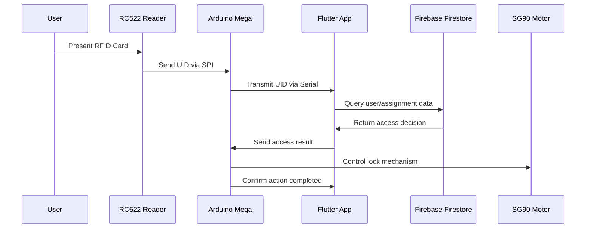

# RapidKL Smart Locker System - IoT Hardware Documentation

## 📋 System Overview
The RapidKL Smart Locker System is an RFID-based access control system that integrates Arduino hardware with Firebase cloud services through a Flutter application interface.

## 🔧 Hardware Components

### Core Components
| Component | Model/Type | Purpose | Specifications |
|-----------|------------|---------|----------------|
| **Microcontroller** | Arduino Mega 2560 | Main processing unit | 54 digital I/O pins, 16 analog inputs, 256KB Flash |
| **RFID Reader** | RC522 | Card/tag scanning | 13.56MHz, SPI interface, 3.3V operation |
| **Servo Motor** | SG90 | Lock mechanism | 180° rotation, 4.8-6V, 2.5kg·cm torque |
| **Power Supply** | External 5V | Servo power | Prevents Arduino brownout |
| **Connectivity** | USB Serial | Data communication | Arduino ↔ Computer interface |

### Supporting Components
- Breadboard (for prototyping)
- Jumper wires (male-to-male, male-to-female)
- Pull-up resistors (if needed for SPI)
- LED indicators (optional for status)

## 🔌 Pin Configuration

### RC522 RFID Reader Connections
```
RC522 Pin    →    Arduino Mega Pin
SDA (SS)     →    Pin 53
SCK          →    Pin 52
MOSI         →    Pin 51
MISO         →    Pin 50
IRQ          →    Not connected
GND          →    GND
RST          →    Pin 5
3.3V         →    3.3V
```

### SG90 Servo Motor Connections
```
Servo Wire   →    Connection
Red (VCC)    →    External 5V Power Supply (+)
Brown (GND)  →    External 5V Power Supply (-) + Arduino GND
Orange (PWM) →    Arduino Pin 9 (PWM capable)
```

### Power Distribution
```
Arduino Mega 2560:
- USB Power: 5V from computer
- Logic Power: Internal 3.3V regulator

External 5V Supply:
- Servo Motor: 5V/1A minimum
- Common Ground: Connected to Arduino GND
```

## ⚙️ System Architecture

### Data Flow Diagram
```
[RFID Card] → [RC522 Reader] → [Arduino Mega] → [USB Serial] → [Flutter App] → [Firebase] → [Access Decision] → [Servo Control]
```

### Communication Protocol
1. **RFID Scanning**: RC522 reads card UID via SPI
2. **Serial Transmission**: Arduino sends UID to Flutter via USB
3. **Cloud Verification**: Flutter queries Firebase Firestore
4. **Access Control**: Decision sent back to Arduino
5. **Physical Action**: Servo motor actuates lock

## 🔄 Operational Workflow

### Access Sequence


### Firebase Data Validation
The system checks multiple conditions:
- ✅ User exists and is active
- ✅ RFID UID is registered to user
- ✅ User has valid locker assignment
- ✅ Assignment is not expired
- ✅ Locker is operational

## 📊 Current Setup Analysis

### ✅ Strengths
1. **Reliable Hardware**: Arduino Mega provides ample I/O and processing power
2. **Standard Components**: RC522 and SG90 are well-documented, affordable
3. **Separate Power**: External servo power prevents Arduino brownout
4. **Cloud Integration**: Firebase provides scalable backend
5. **Real-time Logging**: All access attempts logged for audit

### ⚠️ Areas for Improvement

#### Security Enhancements
1. **RFID Cloning Protection**: RC522 uses basic 13.56MHz - consider encrypted cards
2. **Physical Security**: Add tamper detection switches
3. **Communication Encryption**: Serial data is unencrypted
4. **Backup Authentication**: Add keypad or mobile app backup

#### Reliability Improvements
1. **Power Redundancy**: Add battery backup for power outages
2. **Connection Monitoring**: Detect USB disconnection
3. **Servo Feedback**: Add position sensors to confirm lock state
4. **Error Recovery**: Automatic retry mechanisms

#### Scalability Considerations
1. **WiFi Integration**: ESP8266/ESP32 for wireless operation
2. **Multiple Lockers**: CAN bus or I2C expansion
3. **Local Caching**: Store recent access data locally
4. **OTA Updates**: Remote firmware updates

## 🛠️ Recommended Improvements

### Phase 1: Immediate Enhancements
```arduino
// Add status LEDs
#define LED_READY    2    // Green: System ready
#define LED_ACCESS   3    // Blue: Card detected
#define LED_GRANTED  4    // Green: Access granted
#define LED_DENIED   7    // Red: Access denied

// Add buzzer for audio feedback
#define BUZZER_PIN   8

// Add tamper switch
#define TAMPER_PIN   6
```

### Phase 2: Advanced Features
1. **ESP32 Integration**: Replace Arduino Mega with ESP32 for WiFi
2. **Encrypted RFID**: Upgrade to MIFARE DESFire or similar
3. **Biometric Backup**: Add fingerprint sensor
4. **Mobile App**: Direct Bluetooth/WiFi control

### Phase 3: Production Ready
1. **PCB Design**: Custom board for reliability
2. **Enclosure**: Weatherproof housing
3. **Professional Installation**: Proper mounting and wiring
4. **Monitoring Dashboard**: Real-time system health

## 🔧 Arduino Code Structure

### Core Functions Required
```arduino
// RFID Management
void initRFID();
String readRFIDCard();
bool isCardPresent();

// Serial Communication
void sendUIDToFlutter(String uid);
String receiveAccessDecision();

// Servo Control
void unlockLocker();
void lockLocker();
void setServoPosition(int angle);

// System Status
void updateStatusLEDs(int status);
void playAccessSound(bool granted);
```

### Recommended Libraries
```arduino
#include <SPI.h>           // For RC522 communication
#include <MFRC522.h>       // RFID reader library
#include <Servo.h>         // Servo motor control
#include <ArduinoJson.h>   // JSON parsing (optional)
```

## 📈 Performance Specifications

### Response Times
- **RFID Detection**: < 100ms
- **Serial Communication**: < 50ms
- **Firebase Query**: 200-500ms (network dependent)
- **Servo Actuation**: 500-1000ms
- **Total Access Time**: < 2 seconds

### Power Consumption
- **Arduino Mega**: ~50mA @ 5V
- **RC522 Reader**: ~26mA @ 3.3V
- **SG90 Servo**: 100-200mA @ 5V (active), 10mA (idle)
- **Total System**: ~300mA peak, ~100mA idle

## 🚀 Demo Optimization

### For Presentation/Demo
1. **Visual Indicators**: Bright LEDs for each state
2. **Audio Feedback**: Clear beeps for success/failure
3. **Quick Response**: Optimize Firebase queries
4. **Reliable Cards**: Use quality RFID cards/tags
5. **Stable Mounting**: Secure all connections
6. **Backup Power**: Portable power bank for demos

### Troubleshooting Checklist
- [ ] All connections secure
- [ ] External power supply connected
- [ ] Arduino IDE serial monitor working
- [ ] Flutter app connected to Firebase
- [ ] RFID cards properly registered
- [ ] Servo moves freely without obstruction

## 📋 Bill of Materials (BOM)

| Item | Quantity | Estimated Cost (USD) |
|------|----------|---------------------|
| Arduino Mega 2560 | 1 | $25 |
| RC522 RFID Reader | 1 | $5 |
| SG90 Servo Motor | 1 | $3 |
| 5V Power Supply | 1 | $8 |
| Breadboard | 1 | $5 |
| Jumper Wires | 1 set | $5 |
| RFID Cards/Tags | 10 | $5 |
| LEDs & Resistors | 1 set | $3 |
| **Total** | | **~$59** |

## 🎯 Conclusion

Your current setup is **solid for a prototype/demo** with good component choices and proper power management. The Arduino Mega provides excellent development flexibility, and the RC522/SG90 combination is reliable and cost-effective.

### Immediate Recommendations:
1. Add visual/audio feedback for better user experience
2. Implement error handling and recovery mechanisms
3. Consider ESP32 upgrade for future wireless capability
4. Add physical security features (tamper detection)

### Long-term Vision:
The system has excellent potential for scaling to a production environment with proper enclosure design, security enhancements, and wireless connectivity.

---
*This documentation serves as a comprehensive guide for the RapidKL Smart Locker System hardware implementation and future development roadmap.*